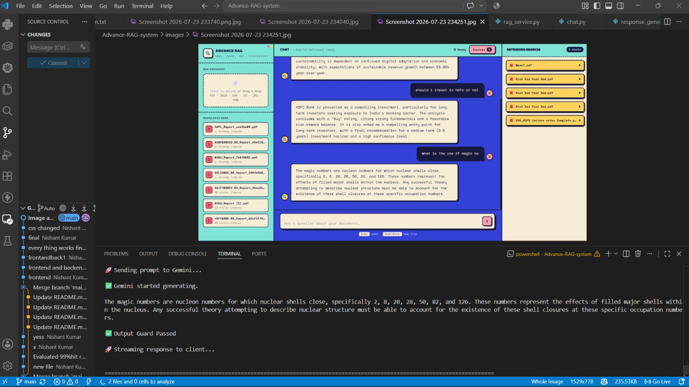
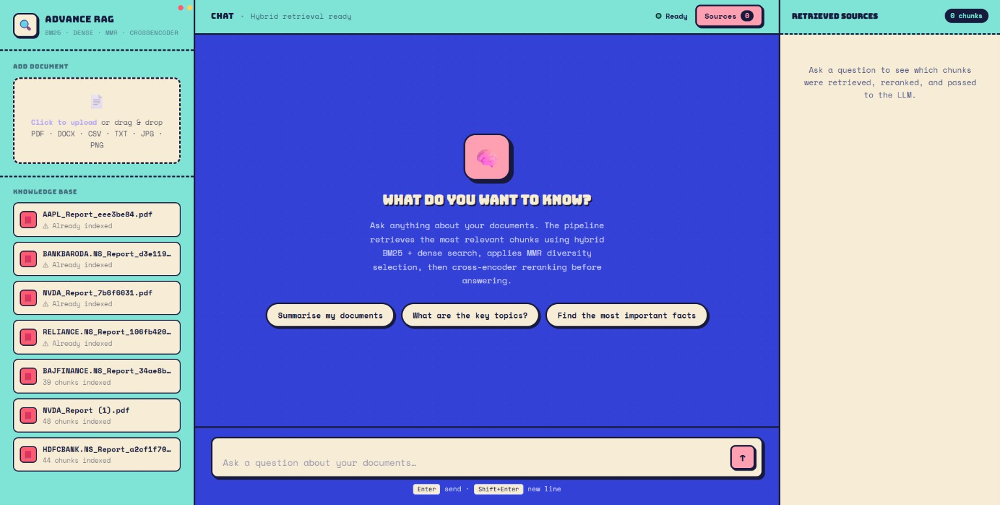
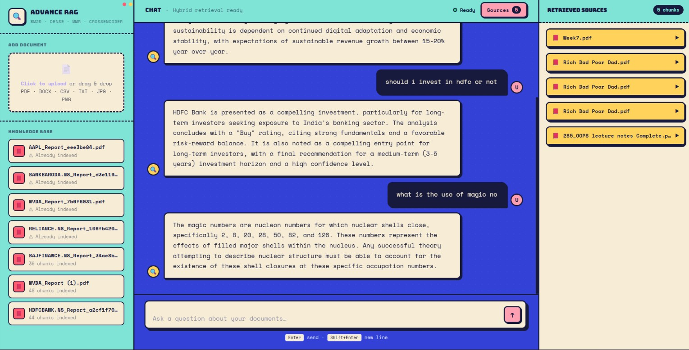

# 🚀 Advance RAG System

A production-style Retrieval-Augmented Generation (RAG) system built using LangChain, LangSmith, Qdrant, Hybrid Search, BM25, MMR, Cross-Encoder Reranking, and Large Language Models.

The system supports document ingestion, intelligent retrieval, retrieval evaluation, grounded response generation, and performance monitoring from user-provided knowledge bases.

---

# ✨ Features

* PDF Document Ingestion
* Multi-threaded Processing Pipeline
* Automatic Metadata Generation
* Recursive Text Chunking
* Dense Vector Embeddings
* Local Qdrant Vector Database
* BM25 Sparse Retrieval
* Hybrid Search (Dense + Sparse)
* MMR (Maximal Marginal Relevance) Diversification
* Cross-Encoder Reranking
* Duplicate Document Detection using File Hashing
* Streaming LLM Responses
* LangSmith Observability & Tracing
* Retrieval Evaluation Framework
* Hit Rate Measurement
* Recall@K Evaluation
* Mean Reciprocal Rank (MRR) Evaluation
* Automated Benchmarking Reports
* Local-First Architecture

---

# 🏗️ System Architecture

```text
                 ┌──────────────────┐
                 │   PDF Documents   │
                 └─────────┬────────┘
                           │
                           ▼
                 ┌──────────────────┐
                 │ Text Extraction  │
                 └─────────┬────────┘
                           │
                           ▼
                 ┌──────────────────┐
                 │ Text Cleaning    │
                 └─────────┬────────┘
                           │
                           ▼
                 ┌──────────────────┐
                 │ Metadata Builder │
                 └─────────┬────────┘
                           │
                           ▼
                 ┌──────────────────┐
                 │ Recursive Chunk  │
                 └─────────┬────────┘
                           │
                           ▼
                 ┌──────────────────┐
                 │ BGE Embeddings   │
                 └─────────┬────────┘
                           │
          ┌────────────────┴───────────────┐
          │                                │
          ▼                                ▼
 ┌─────────────────┐             ┌─────────────────┐
 │ Qdrant VectorDB │             │   BM25 Index    │
 └─────────────────┘             └─────────────────┘


                   USER QUERY
                         │
                         ▼
                Query Embedding
                         │
          ┌──────────────┴──────────────┐
          │                             │
          ▼                             ▼
   Dense Retrieval              Sparse Retrieval
      Top 15                        Top 7
          │                             │
          ▼                             │
        MMR                             │
      Top 8                             │
          │                             │
          └──────────────┬──────────────┘
                         ▼
                 Merge & Deduplicate
                         │
                         ▼
                 Cross Encoder
                   Reranker
                    Top 5
                         │
                         ▼
                       LLM
                         │
                         ▼
                  Final Response
```

---

# ⚙️ Technology Stack

## Retrieval

* Qdrant
* BM25
* MMR

## Embeddings

* BAAI/bge-small-en-v1.5

## Reranking

* cross-encoder/ms-marco-MiniLM-L-6-v2

## Framework

* LangChain

## Monitoring

* LangSmith

## Database

* SQLite
* Qdrant

## LLMs

* Gemini 2.5 Flash
* Mistral Large (Supported)

## Evaluation

* Custom Retrieval Evaluation Framework
* Hit Rate
* Recall@5
* Mean Reciprocal Rank (MRR)

---

# 📂 Project Structure

```text
app/
│
├── ingestion/
│   ├── extractor/
│   ├── chunking/
│   ├── embedding/
│   ├── retrieval/
│   ├── registry/
│   ├── vectordb/
│   └── pipeline/
│
├── generation/
│   ├── llm.py
│   ├── prompt_builder.py
│   ├── response_generator.py
│   └── rag_pipeline.py
│
evaluation/
│
├── datasets/
├── metrics/
├── reports/
├── retrieval_evaluator.py
└── run_eval.py
│
storage/
│
├── qdrant_data/
├── bm25/
└── registry.db
│
main.py
```
#RAW PIC

#Dashboard

---

# 🔄 Ingestion Pipeline

```text
PDF
 ↓
Extract Text
 ↓
Clean Text
 ↓
Generate Metadata
 ↓
Chunk Document
 ↓
Generate Embeddings
 ↓
Store in Qdrant
 ↓
Store in BM25
 ↓
Mark as Processed
```

---

# 🔍 Retrieval Pipeline

## Dense Retrieval

```text
Query
 ↓
Embedding
 ↓
Top 15 Dense Chunks
```

## MMR Diversification

```text
15 Dense Chunks
 ↓
MMR
 ↓
8 Diverse Chunks
```

## Sparse Retrieval

```text
Query
 ↓
BM25
 ↓
Top 7 Sparse Chunks
```

## Cross Encoder Reranking

```text
8 MMR Chunks
 +
7 BM25 Chunks
 ↓
Cross Encoder
 ↓
Top 5 Chunks
```

---

# 🛡️ Duplicate Document Protection

```text
File
 ↓
SHA256 Hash
 ↓
Registry Check
 ↓
Already Processed?
 ↓
YES → Skip
NO  → Process
```

Benefits:

* Prevents duplicate embeddings
* Faster ingestion
* Reduced storage usage
* Consistent indexing

---

# 🚀 Performance Optimizations

## SQLite Concurrency Fix

Enabled:

```python
PRAGMA journal_mode=WAL;
```

Benefits:

* Eliminated database locking
* Improved multi-threaded ingestion

---

## Hybrid Retrieval Optimization

### Previous Architecture

```text
Dense (15)
+
BM25 (15)
↓
Embed Again
↓
MMR
↓
Rerank
```

Problems:

* Duplicate embeddings
* Additional embedding calls
* High latency
* Shape mismatch issues
* Complex retrieval flow

---

### Current Architecture

```text
Dense (15)
↓
MMR (8)

BM25 (7)

Merge
↓
Rerank (5)
```

Benefits:

* Lower latency
* Reduced embedding calls
* Better retrieval diversity
* Cleaner architecture
* Faster response generation

---

# 📈 Latency Improvements

Measured using LangSmith Tracing.

## Before Optimization

| Query | Latency |
| ----- | ------- |
| Run 1 | 48.52s  |
| Run 2 | 45.37s  |

Average:

```text
~47 Seconds
```

---

## After Optimization

| Query | Latency |
| ----- | ------- |
| Run 1 | 2.18s   |
| Run 2 | 2.26s   |
| Run 3 | 1.86s   |

Average:

```text
~1.29 Seconds
```

---

## Improvement

```text
47s → 1.29s

≈ 97.3% Latency Reduction
≈ 36x Faster Retrieval
```
#Chat

---

# 📊 Retrieval Evaluation

To quantitatively measure retrieval quality, a custom evaluation framework was built.

The evaluation benchmark consists of:

* 100 curated evaluation questions
* Ground-truth source documents
* Reference chunk annotations
* Automated evaluation reports

---

## Evaluation Metrics

### Hit Rate

Measures whether the correct source document appears in retrieved results.

### Recall@5

Measures whether the correct source document is present within the top 5 retrieved chunks.

### Mean Reciprocal Rank (MRR)

Measures how highly the correct source document is ranked.

```text
MRR = 1 / Rank
```

Higher values indicate better ranking quality.

---

## Evaluation Workflow

```text
Question
    ↓
Retrieval Pipeline
(Dense + BM25 + MMR + Reranker)
    ↓
Top 5 Chunks
    ↓
Source Validation
    ↓
Metric Calculation
```

---

## Evaluation Results

| Metric                    | Score  |
| ------------------------- | ------ |
| Questions Evaluated       | 100    |
| Hit Rate                  | 99.00% |
| Recall@5                  | 99.00% |
| MRR                       | 0.8995 |
| Average Retrieval Latency | 1.29s  |

---

## Key Findings

* 99 out of 100 evaluation queries retrieved the correct source document.
* MRR of 0.8995 indicates relevant information is typically ranked at the top.
* Average retrieval latency remained near real-time performance.
* Hybrid Retrieval + MMR + Cross-Encoder Reranking achieved both high accuracy and low latency.

---

## Generated Evaluation Reports

Each evaluation run generates:

```text
evaluation/reports/results.json
```

containing:

* Question
* Expected Source
* Retrieved Sources
* Hit/Miss Status
* MRR Score
* Latency

---

# ▶️ Running the Project

## Clone Repository

```bash
git clone <your-repository-url>
cd Advance-RAG-system
```

---

## Create Virtual Environment

```bash
python -m venv .venv
```

### Windows

```bash
.venv\Scripts\activate
```

### Linux / Mac

```bash
source .venv/bin/activate
```

---

## Install Dependencies

```bash
pip install -r requirements.txt
```

or

```bash
uv sync
```

---

## Configure Environment Variables

Create a `.env` file:

```env
GOOGLE_API_KEY=your_api_key

LANGCHAIN_API_KEY=your_langsmith_key
LANGCHAIN_TRACING_V2=true
LANGCHAIN_PROJECT=Advance-RAG-System
```

---

## Run Document Ingestion

```bash
python main.py
```

Choose:

```text
1. Run Ingestion
```

---

## Start RAG Chat

```bash
python main.py
```

Choose:

```text
2. Start RAG Chat
```

---

## Run Retrieval Evaluation

```bash
python -m evaluation.run_eval
```

Generated reports will be stored in:

```text
evaluation/reports/results.json
```

---

# 📊 Observability

LangSmith is integrated for:

* Request Tracing
* Latency Monitoring
* Token Usage Tracking
* Retrieval Debugging
* Prompt Inspection
* Pipeline Performance Analysis

---

# 💡 Example Query Flow

```text
User Question
      ↓
Generate Query Embedding
      ↓
Dense Retrieval (15)
      ↓
MMR (8)
      ↓
BM25 Retrieval (7)
      ↓
Merge Results
      ↓
Cross Encoder Rerank
      ↓
Top 5 Context Chunks
      ↓
LLM Generation
      ↓
Final Answer
```

---

# 👨‍💻 Author

**Nishant Kumar**

Built as a deep dive into modern Retrieval-Augmented Generation systems, hybrid retrieval, vector databases, reranking, retrieval evaluation, observability, and production-grade AI pipelines.

---

## ⭐ If you found this project useful, consider starring the repository.
